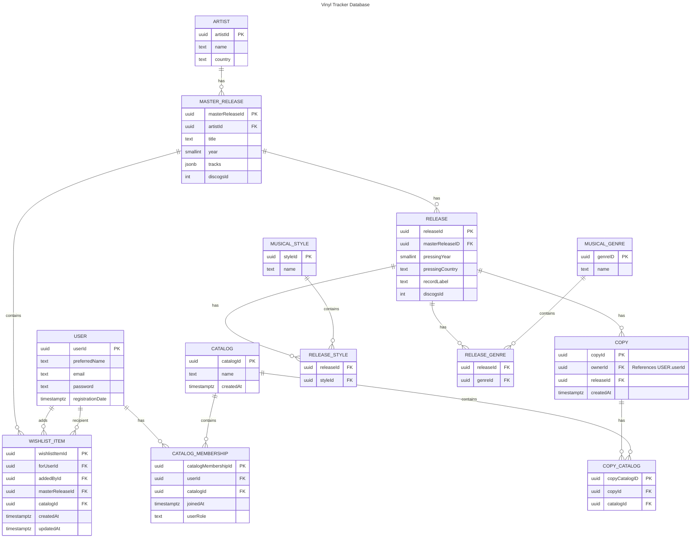

```mermaid
---
  title: Vinyl Tracker Database
---
  erDiagram
    USER{
      uuid userId PK
      text preferredName
      text email
      text password
      timestamptz registrationDate
    }
    CATALOG{
      uuid catalogId PK
      text name
      timestamptz createdAt
    }
    CATALOG_MEMBERSHIP{
      uuid catalogMembershipId PK
      uuid userId FK
      uuid catalogId FK
      timestamptz joinedAt
      text userRole
    }
    ARTIST{
      uuid artistId PK
      text name
      text country
    }
    COPY{
      uuid copyId PK
      uuid ownerId FK "References USER.userId"
      uuid releaseId FK
      timestamptz createdAt
    }
    MASTER_RELEASE{
      uuid masterReleaseId PK
      uuid artistId FK
      text title
      smallint year
      jsonb tracks
      int discogsId
    }
    RELEASE{
      uuid releaseId PK
      uuid masterReleaseID FK
      smallint pressingYear
      text pressingCountry
      text recordLabel
      int discogsId
    }
    RELEASE_STYLE{
      uuid releaseId FK
      uuid styleId FK
    }
    RELEASE_GENRE{
      uuid releaseId FK
      uuid genreId FK
    }
    COPY_CATALOG{
      uuid copyCatalogID PK
      uuid copyId FK
      uuid catalogId FK
    }
    MUSICAL_GENRE{
      uuid genreID PK
      text name
      }
    MUSICAL_STYLE{
      uuid styleId PK
      text name
    }
    WISHLIST_ITEM{
      uuid wishlistItemId PK
      uuid forUserId FK
      uuid addedById FK
      uuid masterReleaseId FK
      uuid catalogId FK
      timestamptz createdAt
      timestamptz updatedAt

    }
      USER ||--o{ CATALOG_MEMBERSHIP : has
      CATALOG||--o{ CATALOG_MEMBERSHIP : contains
      MASTER_RELEASE ||--o{ RELEASE : has
      ARTIST ||--o{ MASTER_RELEASE  : has
      MASTER_RELEASE ||--o{ WISHLIST_ITEM : contains
      RELEASE ||--o{ RELEASE_GENRE : has
      MUSICAL_GENRE ||--o{ RELEASE_GENRE : contains
      RELEASE ||--o{ RELEASE_STYLE : has
      MUSICAL_STYLE ||--o{ RELEASE_STYLE : contains
      RELEASE ||--o{ COPY : has
      COPY ||--o{ COPY_CATALOG : has
      CATALOG ||--o{ COPY_CATALOG : contains
      USER ||--o{ WISHLIST_ITEM : adds
      USER ||--o{ WISHLIST_ITEM : recipient
```
