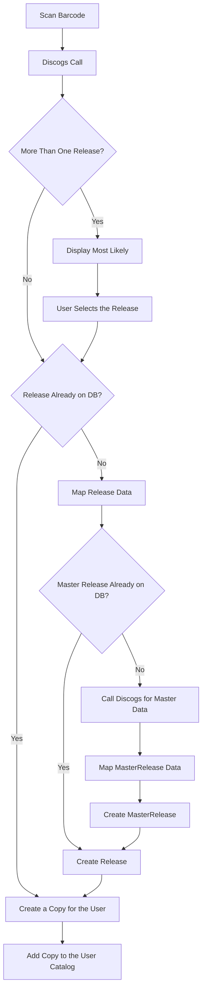

```mermaid
  flowchart TD
    A[Scan Barcode] --> B[Discogs Call]
    B --> C{More Than One Release?}
    C --> |Yes| D[Display Most Likely]
    C --> |No| F
    D --> N[User Selects the Release]
    N --> F{Release Already on DB?}
    F --> |Yes| L
    F --> |No| E[Map Release Data]
    E --> G{Master Release Already on DB?}
    G --> |Yes| H[Create Release]
    G --> |No| I[Call Discogs for Master Data]
    I --> J[Map MasterRelease Data]
    J --> K[Create MasterRelease]
    K --> H
    H --> L[Create a Copy for the User]
    L --> M[Add Copy to the User Catalog]
```
